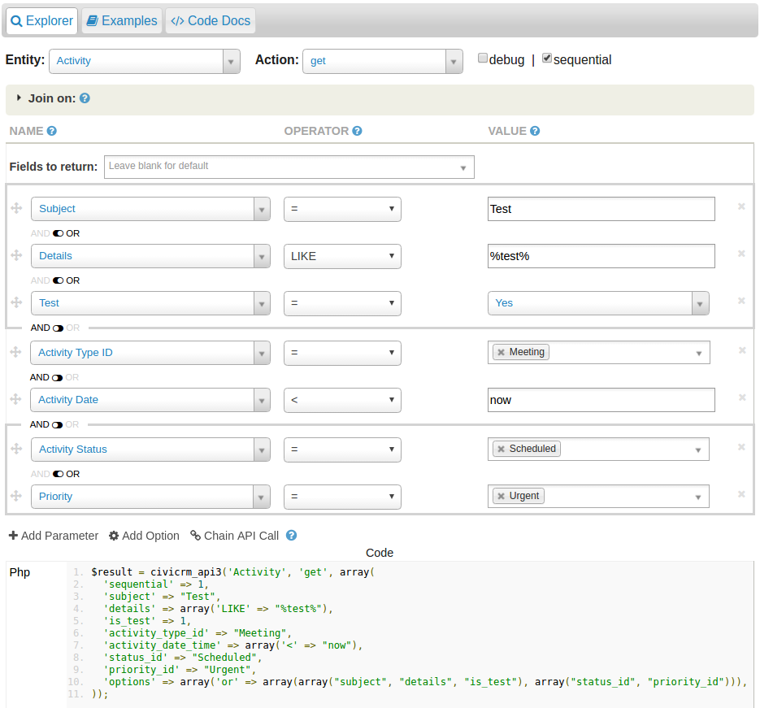

# APIv3 Changelog

*This page lists additions to the APIv3 with each new release of CiviCRM Core.*

Also see: [Differences Between Api v3 and v4](../v4/differences-with-v3.md) and [Hooks Changelog](../../hooks/changes.md).

## APIv3: Framework

### 5.12 Support for string 'NULL' as an accepted value for custom data fields

The API has now been changed such that when setting the value of a custom field using the API if you pass the string 'NULL' then it will set the field value to be the String NULL not the database NULL. If you want the value to be truely NULL then you need to either not pass in the value or use 'null' instead

### 5.8 Support for Extension Examples in the API Explorer.

From 5.8 it is now possible for Extension authors to store examples for their API entities in a folder `<extensiondir>/api/v3/examples/<entity>/<file>` in the same structure as is in core. They will now be displayed in the API Explorer just like the core examples.

### 5.0 Support for custom data on any entity via the api
It is now possible to add any (almost) entity to the cg_group_extends option group and create / retrieve custom data for that field via the api (also custom entities). Ones that do not work as of 5.0 release are       
      'CaseContact',
      'CustomField',
      'CustomGroup',
      'DashboardContact',
      'Domain',
      'File',
      'FinancialType',
      'LocBlock',
      'MailingEventConfirm',
      'MailingEventResubscribe',
      'MailingEventSubscribe',
      'MailingEventUnsubscribe',
      'MailingJob',
      'MembershipPayment',
      'SavedSearch',
      'UFJoin',
      'UFField',
      'PriceFieldValue',
      'GroupContact',
      'EntityTag',
      'PledgePayment',

### 5.0 Support for Serialization Metadata ###
A field defined with the key 'serialize' (in the metadata) will be serialized on save/create with no additional handling if using basic create methods. Generally this is used by adding `<serialize>JSON</serialize>` to the xml when generating the DAO. [Example declaration](https://github.com/eileenmcnaughton/org.wikimedia.geocoder/blob/master/CRM/Geocoder/DAO/Geocoder.php#L259)

### 4.7.17: OR Operator

Most API "get" operations (with the exception of some nonstandard entities - Contact, Contribution, Pledge & Participant) [now support the OR operator](https://issues.civicrm.org/jira/browse/CRM-20034). Use the API Explorer to see the syntax. 

### 4.7.13: Standardized output of EntityTag api

The EntityTag api had nonstandard output which indexed results by the `tag_id` column instead of the id column. This was [cleaned up as part of permission fixes](https://github.com/civicrm/civicrm-core/pull/9174) in 4.7.13. Any custom code relying on this quirk will need to be updated.

### 4.7.11: Added generic action 'validate'

A generic validate action which can be used to return an array of errors in an API call. The error values returned are `key =&gt;` value pairs with the key being the name of the field and value array containing a description message and error code. For example:

```php
    civicrm_api3('Contact', 'validate', array('action' => "create"));

    { "is_error": 0,
     "version": 3,
     "count": 1,
     "id": 0,
     "values": [
      {
        "contact_type":
           {
            "message": "Mandatory key(s) missing from params array: contact_type",
            "code": "mandatory_missing"
           }
       }
     ]
    }
```

### 4.7.0: Support for joins across multiple entities

Most api "get" operations now support joining onto related entities for the filters, return values, or sort fields.

### 4.7.0: REST XML format

The encoding of some values in the XML-based API changed. [Changes](https://github.com/civicrm/civicrm-core/pull/6043).

### 4.7.0: Permission changes

-   If you have 'access CiviCRM' permissions, you can now retrieve countries: [CRM-16963](https://issues.civicrm.org/jira/browse/CRM-16963) and [CRM-16963 Changes](https://github.com/civicrm/civicrm-core/pull/6408)
-   If you have 'edit all contacts' permissions, you can now delete relationships using the API: [CRM-15991](https://issues.civicrm.org/jira/browse/CRM-15991) and  [CRM-15991 Changes](https://github.com/civicrm/civicrm-core/pull/6378)
-   Contact related apis (phone, email, address, im, website, relationship, case, etc.) now respect fine-grained contact ACLs instead of requiring heavy-handed permissions like "view all contacts"

### 4.7.0: Searching on custom fields now works for all entity types

With previous versions of the API, you could not search on custom fields of entities, except for contacts. This issue has been resolved: now you can search the custom fields of any entity type. See [CRM-16036](https://issues.civicrm.org/jira/browse/CRM-16036) and [CRM-16036 Changes](https://github.com/civicrm/civicrm-core/pull/6488). This fix involved a considerable change in the inner workings of the API, so it may cause some unexpected results. If you bump into an issue, please report it.

### 4.6.7 Multi-select custom field are always returned as numerical indexed arrays

In previous versions of the API, multi-select custom fields were returned either as numerical indexed arrays, either as key-value arrays, depending on the entity type the custom field set applied to. From CiviCRM 4.6.7 on, all multi-select custom fields are returned as numerical indexed arrays. See [CRM-15915](https://issues.civicrm.org/jira/browse/CRM-15915) and [CRM-15915 Changes](https://github.com/civicrm/civicrm-core/pull/6430). (This is still work in progress)

### 4.6.7: Fixes for chained calls

Some bugs for API chaining were fixed:

-   You can chain a LocBlock call to an Event call, even if the event doesn't have a loc block: [CRM-16169](https://issues.civicrm.org/jira/browse/CRM-16168).
-   You can chain multiple create calls that create multiple entities at once: [CRM-15815](https://issues.civicrm.org/jira/browse/CRM-15815).
-   Chaining now works with both sequential=1 and reload=1: [CRM-15904](https://issues.civicrm.org/jira/browse/CRM-15904) 

See [Pull Request](https://github.com/civicrm/civicrm-core/pull/6418).

### 4.6.0: 'setvalue' api action deprecated

The 'setvalue' generic api action was used to change one field of a given entity. It was problematic in that it bypassed hooks and business logic related to updating that entity, and is now deprecated. Use the 'create' action instead to update all entities by passing their id plus fields to be modified.

### 4.6.0: Added 'force_rollback' option

The force_rollback option allows one to simulate an API call – all the logic of the API call will run, but any changes to the databases will be rolled back (reverted).

### 4.5.0: Added 'getrefcount' action

API action "getrefcount" is a generic action which counts the number of references to a record. For example:

-   If you called `civicrm_api3('Contact','getrefcount',array('id'=&gt;123)`, the result might tell you that there are a total of 10 references -- 1 reference in `civicrm_email.contact_id`, 2 references in `civicrm_address.contact_id`, 2 references in `civicrm_phone.contact_id`, and 5 references in `civicrm_activity_contact.contact_id`. 
-  The activity type "Survey" is an option-value record. If you queried the refcount for that option-value, the result might list a total of  8 references -- 6 references in `civicrm_activity.activity_type_id`, 1 reference in `civicrm_survey.activity_type_id`, and 1 reference in  CiviCase XML.

The implementation automatically detects the following types of
references:

-   Standard SQL foreign-keys
-   Dynamic SQL foreign-keys which follow the pattern `entity_table+entity_id`.
-   Quasi-SQL foreign keys which are linked to OptionValue's (via "pseudo-constants")

To detect other references, one must implement `hook_civicrm_referenceCounts` or `CRM_Core_Component_Info::getReferenceCounts()`. For example, `CRM_Case_Info implements getReferenceCounts()` to count references from CiviCase XML to activity-types.

### 4.5.0: Added 'getlist' action

API action "getlist" is a wrapper for API action "get." It is used mainly for quicksearch and autocomplete widgets. A call to, for example: `CRM.api3('contact', 'getlist', {input: 'bob'})` will internally call contact.get and return a list of resuts formatted for use by the select2 widget or other autocomplete/search forms. It supports formatted description, icons or other images in the results, infinite scrolling or paging of search results, and context-aware searching.

See [EntityRef Fields documentation](../../framework/quickform/entityref.md) for more info.

### 4.4.5: Added client-side CRM.api3() wrapper

`CRM.api3()` is the new api wrapper in javascript and is the recommended way to call the api from the client-side. It supplants the now deprecated `cj().crmAPI()` and `CRM.api()` functions.

The new wrapper does *not* accept callback functions but instead returns a jQuery deferred object which you can attach one or more handlers to.

The new wrapper supports issuing multiple api calls in a single requestto save bandwidth and server-load.

### 4.4.0: 'getoptions' action accepts additional params related to context

See [Pseudoconstant (option list) Reference](../../framework/pseudoconstant.md)

### 4.4.0: 'getoptions' action respects 'sequential' param

The 'sequential' param will cause results to be returned in a non-associative array, which is especially useful for json. Prior to 4.4, this param was ignored for the 'getoptions' action. This has now been fixed.

!!! caution
    Because api calls from the smarty context set 'sequential=1' as a default, this will produce inconsistent results from 4.3 to 4.4 if you do not explicitly set this param. 

See:[CRM-13608](http://issues.civicrm.org/jira/browse/CRM-13608)

### 4.4.0: 'create' action accepts 'options.reload=1'

When calling the "create" action, the API returns a copy of the record. However, for many entities, the returned value does not meet expectations – for example, if a hook (like `hook_civicrm_post`) has manipulated the record in the DB, then the manipulated record will not appear the return-value. Also, any field-values with dates or NULLs may appear unusually formatted. If your application relies on the return-value being correct & consistent, then pass in 'option.reload=1', e.g.

```php
$result = civicrm_api3('Contact', 'create', array(
  'contact_type' => 'Individual',
  'first_name' => 'First',
  'last_name' => 'Last',
  'nick_name' => 'Firstie',
  'options' => array(
    'reload' => 1,
  ),
));
```

After completely creating or updating the record, the API will reload the record with "get". This ensures greater consistency but may incur a slight performance penalty.

See also: [CRM/Utils/API/ReloadOptionTest.php](https://github.com/civicrm/civicrm-core/blob/master/tests/phpunit/CRM/Utils/API/ReloadOptionTest.php)

### 4.4.0: 'create' and 'replace' actions accept 'options.match' or 'options.match-mandatory'

When calling the "create" or "replace" action, one may wish to update an existing record. In this past, this required passing the ID. If one passes 'options.match', the API will attempt to update an existing record.

The option is available in two variations, 'options.match' and 'options.match-mandatory' (which requires that a match be found – if no match is found, it raises an error).

**Using "options.match" with "create"**
```php
// Create "Jeffrey Lebowski" with external ID "1234".
// If a contact already exists with external ID "1234", update it.
$result = civicrm_api3('contact', 'create', array(
  'contact_type' => 'Individual',
  'first_name' => 'Jeffrey',
  'last_name' => 'Lebowski',
  'nick_name' => 'The Dude',
  'external_identifier' => '1234',
  'options' => array(
    'match' => 'external_identifier',
  ),
));
```

**Using "options.match" with "replace"**
```php
// Update contact #123 and reconcile his email addresses with the given list.
//
// If the contact already has an email record for "one@example.com", it will
// be updated. (Extra metadata -- like on-hold status -- will be preserved.)
// If not, a new email record will be inserted.
//
// Similarly, an email record for "two@example.com" will be updated or
// inserted.
//
// Any other email records for contact #123 will be deleted.
$result = civicrm_api3('contact', 'create', array(
  'id' => 123,
  'api.Email.replace' => array(
    'values' => array(
      array('email' => 'one@example.com', 'location_type_id' => 1),
      array('email' => 'two@example.com', 'location_type_id' => 2),
    ),
    'options' => array('match' => 'email'),
  ),
));
```
See also: [CRM/Utils/API/MatchOptionTest.php](https://github.com/civicrm/civicrm-core/blob/master/tests/phpunit/CRM/Utils/API/MatchOptionTest.php)

### 4.4.0: Smarty wrapper defaults to 'sequential'

Because 'sequential' gives a more concise format, it has been made the default in smarty. If you do not want the sequential format, add sequential=0 to your smarty api call.

### 4.3.0: New 'getoptions' action

Fetch the options for a specified field e.g. `civicrm_api('contact', 'getoptions' array('field' => 'gender_id'));` returns `array(1 => 'Female', 2 => 'Male', 3 => 'Transgender')`

See [Pseudoconstant (option list) Reference](../../framework/pseudoconstant.md)

### 4.3.0: Deprecating action=update

CRM-12140: The API update action was a clunky hack (get+create) to workaround the problems on the create api with an id set (mostly forcing default values). We have now have all (well, at least most of) the entities that behaves on create. We are keeping the action=update working as it was, but no longer mention it in the docs and have removed it from the api explorer as a default action

### 4.3.0: Default permission changed from "access CiviCRM" to "administer CiviCRM"

-   [CRM-11329](http://issues.civicrm.org/jira/browse/CRM-11329#comment-46699)
-   This affects API functions called with `check_permissions = 1` (all AJAX, & REST calls) where the permission is not otherwise     defined
-   **This could affect you if**\
    1.   you use Rest / Ajax for non permissioned users or you use the `check_permissions` flag in smarty or php calls AND
    2.   You access API functions in this way which don't have explicitly defined permissions in CRM/Core/DAO/,permissions.php (most common functions are defined)
    3.  You use custom api via REST and have not defined the permissions for them (using the hook)
-   See the ticket for more

### 4.3.0: AJAX: cj().crmAPI() is now CRM.api()

Prior to 4.3, the syntax for [AJAX](../interfaces.md#AJAX) API calls was 

```javascript
cj().crmAPI('Entity', 'action', {...params...}, {
  callBack: function(data) { ... }
});
```

This notation is still supported in 4.3. However, the recommended notation has changed to:

```javascript
CRM.api('Entity', 'action', {...params...}, {
  success: function(data) { ... }
});
```

### 4.3.0: REST: user/password authentication unsupported

In previous releases, REST API calls supported two forms of authentication:

-   Authentication with a per-user API key (e.g. `rest.php?entity=contact&action=get&api_key=...&key=...`) 
-   Authentication with a username/password (e.g.`rest.php?q=civicrm/login&user=...&pass=...&key=...`) and subsequent requests with a PHPSESSID (e.g. `rest.php?q=civicrm/contact/get&PHPSESSID=...&key=...`)

The second form is no longer supported.

### 4.3.5 / 4.2.10: Introduction of civicrm_api3 wrapper

This allows the syntax

```php
try {
  civicrm_api3('contact', 'get', array());
  civicrm_api3('contribution', 'sendconfirmation', array('id' => 100));
}
catch (CiviCRM_API3_Exception $e) {
  $error = $e->getMessage();
}
```

## APIv3: Specific APIs (Changes)

### 4.7.25: Event API. price_set_id not returned unless specified.

This api now follows the standard convention of only returning extra data when requested. Specify `return: 'price_set_id'` in the params to fetch this field.

### 4.7.20/4.7.13 : Extensions API Get. All Information on Extensions is returned by default

When calling either the get or getsingle action for the Extension API you will now by default be returned all information on an extension rather than just id status and key - See [CRM-19414](https://issues.civicrm.org/jira/browse/CRM-19414). However the initial implementation meant that there was no ability to filter Extensions down to just retrieve either information on one extension or a specific set of fields for extensions. This has been fixed
in [CRM-20532](https://issues.civicrm.org/jira/browse/CRM-20532) released in 4.7.20

### 4.7.11: Group API: "group_type" is supported for both integer and array values

When creating a new Group, the "create" API previously failed for `group_type` parameter. This is now supported for both integer and array values.

-   Using Integer - `group_type => 2` will create a group with only type "Mailing List".
-   Using arrays  - `group_type => array(1, 2)` will create a group with both "Access Control" and "Mailing List" as its types.

### 4.7.0: GroupContact API

Deprecated ability to use the 'create' method with multiple contacts / groups in the format `contact_id.1`, `contact_id.2` / `group_id.1`, `group_id.2` etc. This will be removed in a future version. The new approach, using arrays, is documented in the API additions section.

### 4.6.0: Mailing API

-   Default values now match the default values of the user-interface. For example, if `footer_id` is omitted, then the default footer     is used.
-   When saving a mailing, the recipient list and the scheduled job will not be created by default. They will be created when a `scheduled_date` is set.
-   The default `api.mailing_job.create: 1` has been removed.
-   The "submit" action is akin to "create", but it requires a `scheduled_date` and works with CiviMail's advanced/optional permission model.
-   When using advanced CiviMail workflows, the "create" and "submit" actions will enforce the additional permissions for 'create mailings', 'schedule mailings', and 'approve mailings'.
-   If the site policy requires standard mail-merge tokens (as it should, as it does by default), then the Mailing API will enforce that requirement when scheduling the blast.

### 4.6.0: Mailing Component API

By default, components are now filtered on `is_active=1`. To get the full listing of components (regardless of `is_active`), specify a query value `is_active = NULL`. Make sure you use an API binding that supports NULL (e.g. `civicrm_api3` or JSON-based REST). Example:

```php
civicrm_api3('MailingComponent','get',array('is_active' =>  NULL));
```

### 4.5.0: Case API: "case_type" corresponds to machine-name

When creating a new Case record, the "create" API previously accepted `case_type` using the displayable title of the case-type (e.g. "Housing Support"). Beginning in v4.5, the `case_type` should specify the internal machine-name of the case-type (e.g. `housing_support`). Submitting the displayable title will still work - but this is deprecated. For more discussion about changes to handling of case-type names, see [Check Case Type Name Consistency](https://wiki.civicrm.org/confluence/display/CRMDOC/checkCaseTypeNameConsistency).

### 4.4.0: Activity API Changes

`source_contact_id`  is no longer part of the activity record, it is returned by default from the new activity contact table so the change does not need to affect interactive code

### 4.3.0: Deprecate Constant API

Most `CRM_*_Pseudoconstant methods` (which the 'constant' api is a wrapper for) are deprecated in 4.3 and many are removed in 4.4. To future-proof your code, use the [api.getoptions](../v3/actions.md#getoptions) method instead of the constant api. See [Pseudoconstant (option list) Reference](../../framework/pseudoconstant.md)

### 4.3.0: Contact get API now respects ACLS

This means that contact get api now gets only the contacts for which the logged in person is permission if you set the `check_permissions` flag on the api call (it is always set for REST calls & Smarty). Note that the fields that can be returned from contact api if `check_permissions` is set are restricted to those shown by 'getfields'

Sponsored by Fuzion.

### 4.3.0: Contribution API creates line items

If you create a contribution then a default line item will be automatically created for it according to various rules. If you wish to create the line items yourself you need to add the param `'skipLineItems' => 1`

### 4.3.0: Create events from a template

The event api can now clone templates similar to how the UI can do it. Add the param `template_id` and all properties of that event template (including payment processors, profiles, scheduled reminders, etc) will be added to your new event.

## APIv3: Specific APIs (Additions)

### 4.7.15 StateProvince API

This API can be used to create, update and delete 'state/province' entries via the API. Added in CRM-19688.

### 4.7.7 System.updatelogtables

This api can be called to change the format of the `log_conn_id` fields to a 17 Char varchar - and to switch to using truly unique connection ids. Calling this api can also convert log tables to INNODB - using this hook [hook_civicrm_alterLogTables](../../hooks/hook_civicrm_alterLogTables.md) either in your code or with the [Extension](https://github.com/eileenmcnaughton/nz.co.fuzion.innodbtriggers/blob/master/innodbtriggers.php)

Note that log table conversion can be slow which is why we are offering a conversion tool for the improved `log_conn_id` storage rather than springing it in an upgrade script

### 4.7.0: EntityBatch, SavedSearch, OpenId

These entities are now accessible using the api:

- EntityBatch: [CRM-16842](https://issues.civicrm.org/jira/browse/CRM-16842) and [Pull Request](https://github.com/civicrm/civicrm-core/pull/6211)
- SavedSearch: [CRM-16701](https://issues.civicrm.org/jira/browse/CRM-16701) and [Pull Request](https://github.com/civicrm/civicrm-core/pull/6059)
- OpenId: [CRM-16517](https://issues.civicrm.org/jira/browse/CRM-16517) and [Pull Request](https://github.com/civicrm/civicrm-core/pull/5853)

### 4.7.0: GroupContact API accepts array of contact_id or group_id

It is now possible to add multiple contacts to one or more groups using a standard array. The 'create' method now correctly accepts an array of contact ids in the `contact_id` param, or an array of groups in the `group_id` param. This replaces the legacy functionality that was deprecated in this version.

### 4.7.0: StatusPreference API

The StatusPreference API controls access to the new StatusPreference entity.  It is used to read and write the values for the CiviCRM 4.7 Status Page.

### 4.6.0: Attachment API

The Attachment API allows reading and writing attachments. It is a successor to File API which provides a unified interface for managing 

- `civicrm_file` records,
- `civicrm_entity_file records`, and
- file content on disk. Details (at time of writing):
    - It supports attachments on Activity and Mailing records.
    - Permissions derive from the permissions on the related entity. (Ex: To attach a file to a mailing, one must have permission to  create/edit mailings. To read a file from an activity, one must have  permission to read activities.) Only coarse-grained permissions are supported.
    - It supports 1-M relations (one entity to many attachments). Theoretically, the DB schema allows M-M, but this has not been used in practice and requires more complicated DX.

### 4.6.0: Mailing AB API

The Mailing AB API allows creation of A/B tests.

### 4.5.0: contribution_page.submit action

Similar to profile.submit - this takes the values you would pass into the form and uses them for post processing. - including credit card processing, creating memberships etc. This api has mostly been used in the test suite so far so you should investigate carefully before using it. (Profile.submit is more mature)

### 4.5.0: CaseType API

The CaseType API allows one to create, modify, and delete case types. This includes support for setting the detailed activity/relationship configuration with the "definition" property. For examples, see `api_v3_CaseTypeTest`.

### 4.4.8: FinancialType, FinancialAccount, ActivityContact API

### 4.4.?: Dashboard API -- Enable developers to register new dashlets

```php
$result = civicrm_api3('dashboard', 'create', array(
  'label' => 'New Dashlet element',
  'name' => 'New Dashlet element',
  'url' => 'civicrm/report/list&reset=1&compid=99&snippet=5',
  'fullscreen_url' => 'civicrm/report/list&compid=99&reset=1&snippet=5&context=dashletFullscreen',
));
```

### 4.4.?: DashboardContact API -- Enable developers to assign dashlets to the dashboard for particular users

```php
$result = civicrm_api3('dashboard_contact', 'create', array(
  'contact_id' => $contact['id'],
  'dashboard_id' => $dashresult['id'],
  'is_active' => 1,
));
```

### 4.4.2: ActionSchedule API (Scheduled Reminders)

```php
$activityContacts = CRM_Core_OptionGroup::values('activity_contacts', FALSE, FALSE, FALSE, NULL, 'name');
$assigneeID = CRM_Utils_Array::key('Activity Assignees', $activityContacts);
$targetID = CRM_Utils_Array::key('Activity Targets', $activityContacts);
$scheduledStatus = CRM_Core_OptionGroup::getValue('activity_status', 'Scheduled', 'name');
$mappingId = CRM_Core_DAO::getFieldValue('CRM_Core_DAO_ActionMapping', 'activity_type', 'id', 'entity_value');
$activityTypeId = CRM_Core_OptionGroup::getValue('activity_type', "Meeting", 'name');
$result = civicrm_api3('dashboard', 'create', array(
  'title' => "simpleActionSchedule",
  'recipient' => $assigneeID,
  'limit_to' => 1,
  'entity_value' => $activityTypeId,
  'entity_status' => $scheduledStatus,
  'is_active' => 1,
  'record_activity' => 1,
  'mapping_id' => $mappingId,
));
```

### 4.4.0 Profile submit & getfields api

Using these api along with get you can build your own profile form prefilled with a contact id and use the params from it to submit as if  you were using the built in profile. The prefilling on `cid=0` pages use the profile.get with `contact_id`

### 4.4.0: Soft Credits API

Civi 4.4 has a MIH to support multiple soft credits per contact. The soft credit API supports the new functions. [CRM-12496](http://issues.civicrm.org/jira/browse/CRM-12496)

### 4.4.0: Mailing Contact API

[CRM-12357](http://issues.civicrm.org/jira/browse/CRM-12357)

### 4.4.0: Report Instance API

[CRM-12877](http://issues.civicrm.org/jira/browse/CRM-12877)

### 4.3.4 / 4.2 LTS Contribution.completetransaction action (like an IPN)

This api takes a pending contribution and completes it, updating related entities like memberships and sending out emails as required. Some IPN call this function in their handlePaymentNotification function (as soon as they have ascertained a successful payment)

### 4.3.0: Location Type API

Big thanks to Jon Goldberg  [CRM-11206](http://issues.civicrm.org/jira/browse/CRM-11206)

### 4.3.0: Mailing API

Functions to create new CiviMails contributed by Chris Burgess of Giant Robot.

### 4.3.0 / 4.2.10: Setting API

Settings can be set / retrieved / reverted to defaults for single or mulitple domains using the setting api. There is also the ability to define default settings e.g country - specific ones by hook (Try the civiconfigure extension for more on that)

### 4.3.0: Job API

Schedule cron tasks by creating records with the "Job" API.

### 4.3.0: Payment Processor API

Implements basic CRUD functionality for payment processors.

### 4.3.0: LocBlock API

Although location blocks are no longer used by CiviCRM contacts, they are currently still used for events. So the main purpose of this api is to allow you to CRUD the address, emails and phones associated with an event.

## Object-Oriented APIs

This section doesn't document changes to APIv3 per se – rather, it documents changes to public-facing PHP classes. For example, when a developer writes a custom report or custom search, he typically extends a public-facing PHP class, and any changes to that class should be clearly communicated. 

### 4.3.0: CRM_Contact_Form_Search_Interface::all

The all method has a new parameter and a custom search written for 4.2 needs to be changed to have a new $justIDs = FALSE param. The new signature for all:

```php
function all($offset = 0, $rowcount = 0, $sort = NULL,$includeContactIDs = FALSE, $justIDs = FALSE)
```

You need to upgrade civix as well so it generates this new code for a custom search

### 4.6.0: CRM_Contact_Form_Search_Interface-&gt;buildTaskList

Classes which implement this interface must implement a new method called buildTaskList. This method is responsible for building the list of actions (e.g., Add to Group) that may be performed on set of search results. It differs
from [hook_civicrm_searchTasks](../../hooks/hook_civicrm_searchTasks.md) in that the hook allows a developer to specify tasks by entity (e.g., Contact, Event, etc.) whereas buildTaskList provides the ability to target a specific form. The new method takes a `CRM_Core_Form_Search` object as an argument and should return an array. Dump `CRM_Core_Form_Search()->_taskList` to learn about the format of the array. The array returned by buildTaskList will completely replace the task list.

Aside from the community-maintained custom searches in `CRM/Contact/Form/Search/Custom/`, this change does not affect CiviCRM core. Custom searches which extend `CRM_Contact_Form_Search_Custom_Base` (as do those built on civix) will not be affected, as the method is implemented there.

See [CRM-15965](https://issues.civicrm.org/jira/browse/CRM-15965) for more information.

## Other

### 4.7.0: CRM_Core_Config: Property loading

In previous versions, the properties in `CRM_Core_Config` were loaded from a mix of sources, most notably a SQL field (`civicrm_domain.config_backend`). The `config_backend` contained a mix of canonical settings and caches. For any given property, it was very difficult to trace the lifecycle (e.g. to identify where the property was canonically stored, how it was filtered, or how it could be changed).

In v4.7+, all persistent settings should now be stored canonically in the table *civicrm_setting*, and caches should be stored using a cache service. These are not stored in *civicrm_domain.config_backend*.

To provide backward compatibility, `CRM_Core_Config` defines properties with the magic methods, `__get()`  and `__set()`. To trace a property (and determine where it's truly stored), examine `Core_Config_MagicMerge::getPropertyMap()`.

Most downstream code should work with `CRM_Core_Config` properties the same way as before, but there are a couple caveats:

-   If a property's value is an array, you cannot directly modify the array-elements (e.g. "`$config->foo['bar'] = 123;`); doing so will produce a PHP warning. Instead, you can replace the array `$config->foo = $config->foo + array('bar' => 123);`. (There were no examples of this in the core codebase, but there was one example in the core test suite.)
-   A handful of properties were removed because they appeared to be unused, misleading, or redundant.
-   `enableComponentIDs`, `formKeyDisable`, `gettextCodeset`, `gettextDomain`, `gettextCodeset`, `gettextDomain`, `gettextResourceDir`, `groupTree`, `importDataSourceDir`, `localeCustomStrings`, `mailerPeriod`, `mailerSpoolLimit`, `mapGeoCoding`, `maxImportFileSize`, `maxLocationBlocks`, `oldInputStyle`, `pluginsDir`, `revampPages`, `smartyDir`, `sqlDir`
-   Attempting to access an unknown/undefined property will now trigger an error.

See also: [CRM-16373](https://issues.civicrm.org/jira/browse/CRM-16373)

### 4.7.0: Global $civicrm_setting: Multiple changes

The global variable `$civicrm_setting` is used to [override CiviCRM settings](https://wiki.civicrm.org/confluence/display/CRMDOC/Override+CiviCRM+Settings). It has been changed:

- In previous versions, settings were indexed by group name (e.g. `Search Preferences`). In v4.7+, settings should be indexed by entity name (e.g. `domain` or `contact`). For backward compatibility, most group names are treated as an alias for `domain` or `contact`.
  ```php
  // Old/Deprecated/Verbose. Compatible with v4.1+.
  $civicrm_setting['Search Preferences']['search_autocomplete_count'] = 10;
  $civicrm_setting['CiviCRM Preferences']['remote_profile_submissions'] = FALSE;

  // New/Preferred/Simplified. Compatible with v4.7+.
  $civicrm_setting['domain']['search_autocomplete_count'] = 10;
  $civicrm_setting['domain']['remote_profile_submissions'] = FALSE;
  ```
- `$civicrm_setting` is usually modified within the file `civicrm.settings.php`, but it can be modified at runtime (e.g. in  a hook). *If you modify it at runtime*, then you must also call `useMandatory()` to assimilate the changes. Examples for v4.6 and  v4.7 are compared below.
   ```php
   // Ex: Compatible with v4.6 or older (minimalist)
   function example_hook() {
     global $civicrm_setting;
     $civicrm_setting['Search Preferences']['search_autocomplete_count'] = 10;
   }

   // Ex: Compatible with v4.7 or newer (minimalist)
   function example_hook() {
     global $civicrm_setting;
     $civicrm_setting['domain']['search_autocomplete_count'] = 10;
     Civi::service('settings_manager')->useMandatory();
   }

   // Ex: Compatible with both v4.6 and v4.7
   function example_hook() {
     global $civicrm_setting;
     $civicrm_setting['Search Preferences']['search_autocomplete_count'] = 10;
     if (version_compare('>=', CRM_Utils_System::version(), '4.7.alpha1')) {
       Civi::service('settings_manager')->useMandatory();
     }
   }
   ```

See also: [CRM-16373](https://issues.civicrm.org/jira/browse/CRM-16373).

### 4.7.0: bin: Removed deprecated scripts

Earlier versions of CiviCRM included a number of standalone scripts which could be called using `wget` and `cron`. In Civi v4.1, an API-based job-scheduler was introduced, and these cron scripts moved into APIv3 (`Job.process_mailing`, `Job.process_membership`, etc). Some scripts were left in the "bin/deprecated" folder, but these have now been removed in v4.7.

### 4.6.alpha2: CRM_Core_Payment: Object construction

In prior versions, payment processors followed this practice:

-   (Mandatory) Implement `public static function &singleton($mode, &$paymentProcessor, &$paymentForm = NULL, $force = FALSE)`
-   (Conventional) Implement `public function __construct($mode, &$paymentProcessor)`

In v4.6+, the singleton() has been replaced by a centralized manager (Civi\Payment\System). Individual payment processors no longer require their own singletons. However, the constructor is mandatory:

-   (Optional - for backward compatibility) Implement `public static function &singleton($mode, &$paymentProcessor, &$paymentForm = NULL, $force = FALSE)`
-   (Mandatory) Implement `public function __construct($mode &$paymentProcessor)`

See also: [Pull Request](https://github.com/civicrm/civicrm-core/pull/4865)

### 4.6.alpha1: CRM_Core_Transaction

- `CRM_Core_Transaction` has traditionally used a reference-counting mechanism to combine multiple pieces of business-logic into a single transaction. In 4.6, this remains the default behavior, but  one can also use nested transactions (by passing `$nested=TRUE` to the constructor). Any work done in the nested transaction can be rolled back without affecting the overall transaction.
- Prior to 4.6, the idiom for managing transactions was to call `$tx = new CRM_Core_Transaction()` and rely on the destructor to cleanup the transaction (e.g. issue the COMMIT/ROLLBACK). Unfortunately, it can be cumbersome to correctly apply this idiom when handling exceptions generated by non-Civi classes. 4.6 introduces a safer notation: `CRM_Core_Transaction::create()->run(function($tx){});` which automatically rolls back in case of an exception.

For more details, see [Transaction Reference](../../framework/database/transactions.md).

### 4.5.3: AJAX, Regions, and Resources

CiviCRM 4.2+ allowed developers to inject content on a web page using the [Region](../../framework/region.md) and [Resource](../../framework/resources.md) APIs. CiviCRM 4.5+ introduced broad changes to the page-loading process which cause many pages to load in-situ as "snippets". This significantly improved perceived load times but caused some regressions on customized backend forms which relied on Region or Resource APIs. v4.5.3 introduces the following changes:

-   The `page-header`, `page-body`, and `page-footer` regions will all be processed on normal (full, standalone) pages as well as snippets (embedded AJAX pages).
-   The `html-header` region is only processed on normal-pages.
-   The `ajax-snippet` region is only processed on snippet-pages.
-   Settings exported via Resource API (`CRM_Core_Resources::addSetting()`) will be communicated in both normal-pages and snippet-pages. The settings on the  snippet-page will merge with the settings on the normal-page. Merges are conducted deeply/recursively.

### 4.5.0: CiviCase: Changes in XML

1.  CiviCase XML content may be loaded from the database (`civicrm_case_type.definition`) or from a file (as in previous versions). Database content will take precedence over file content.
2.  CiviCase XML supports additional tags:
    1. A **&lt;CaseType&gt;** may set **&lt;forkable&gt;0&lt;/forkable&gt;**. Use this if you want  to (a) store XML in a file **and** (b) prohibit editing in the GUI See also: [CRM-15097](https://issues.civicrm.org/jira/browse/CRM-15097)
    2. An **&lt;ActivitySet&gt;** may set **&lt;sequence&gt;true&lt;/sequence&gt;** to indicate that  activities are performed in a linear, back-to-back fashion. See  also: [CRM-14727](https://issues.civicrm.org/jira/browse/CRM-14727)
    3.(FIXME: In 4.5.beta6, the two tags have different representations of boolean. In the next release, use "true" or  "false" for both.)

3.  If a CiviCase XML file references an unknown activity-type or relationship-type, then it will be auto-created as a ManagedEntity. Moreover, if the XML changes or disappears, and if there are no records which rely on the activity-type or relationship-type, then it will be auto-removed. ManagedEntities are reconciled (created/preserved/deleted) when editing Casetypes via GUI, during extension install, and during other system flushes.
4.  When using CiviCase XML files, the file-name and machine-name (`civicrm_case_type.name`) **should**match. Admins  may occasionally see a warning if these are mismatched.
    1.  See also: [checkCaseTypeNameConsistency](https://wiki.civicrm.org/confluence/display/CRMDOC/checkCaseTypeNameConsistency)
    2.  The example CiviCase XML files have been renamed:
    
        | Case Type (Title)| Case Type (Name) | Old Filename | New Filename |
        | --- | --- | --- | --- |
        | Housing Support | `housing_support` | `HousingSupport.xml` | `housing_support.xml` |
        | Adult Day Care Referral | `adult_day_care_referral` | `AdultDayCareReferral.xml` | `adult_day_care_referral.xml` |

### 4.4.6, 4.2.17: Profiles: Removed hidden fields

Profile forms previously included hidden fields (`post_URL`, `cancel_URL`, and `add_to_group_id`). If you have customizations which rely on manipulating these hidden fields (e.g. by embedding a profile on a third-party site using a customized HTML snippet), then those customizations may break. However, you may still control the values of `post_URL`, `cancel_URL`, and `add_to_group_id` by configuring the profile's advanced settings. See: [CRM-14856](https://issues.civicrm.org/jira/browse/CRM-14856).
