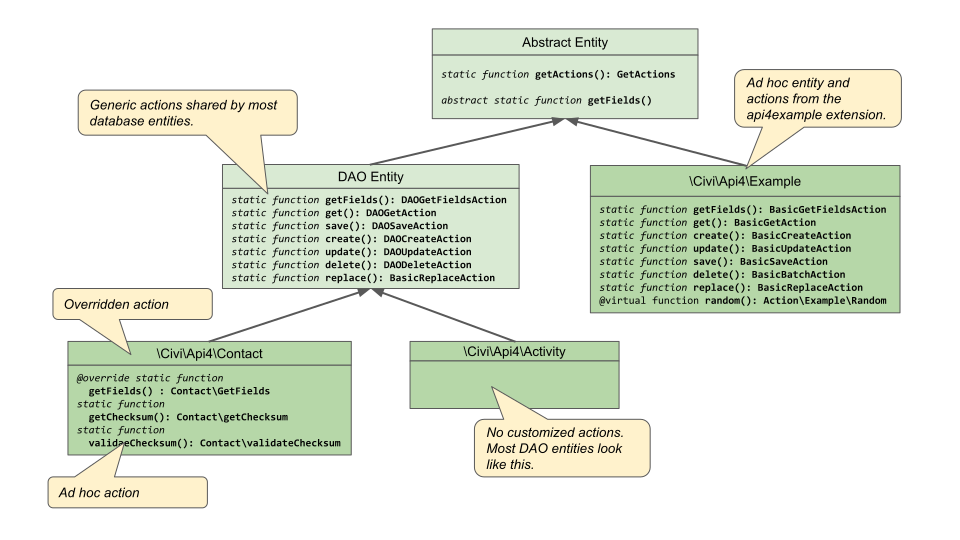
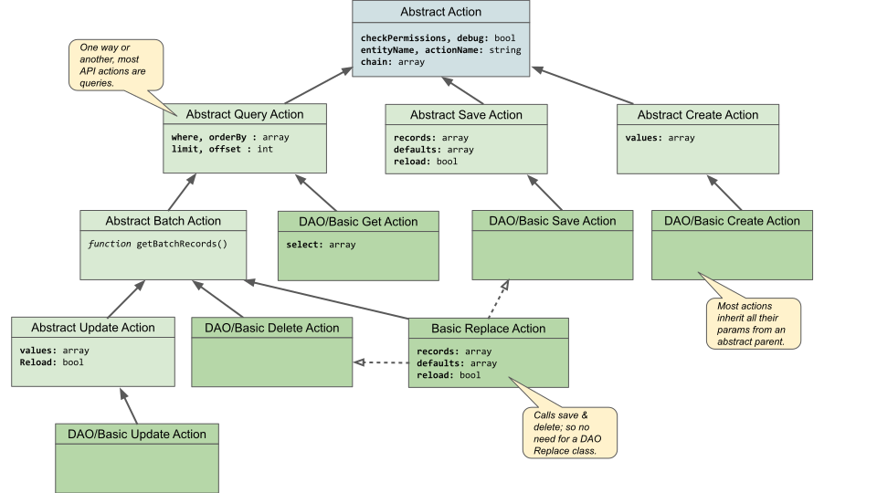

# APIv4 Architecture

*This guide is intended for anyone wishing to extend the CiviCRM API itself, either in core or in their own extension.*

## API Entity Classes

Every API entity is a class which inherits from [`\Civi\Api4\Generic\AbstractEntity`](https://github.com/civicrm/civicrm-core/blob/master/Civi/Api4/Generic/AbstractEntity.php). Each class serves two purposes:

1.  Declare the API entity by its existance.
    - You can declare a new API (e.g. FooBar) simply by placing the class `\Civi\Api4\FooBar` in the `/Civi/Api4` directory of your extension, as long as it inherits from `\Civi\Api4\Generic\AbstractEntity`.
    
2.  Provide factory functions for that entity's **Actions**.

## API Action Classes

Every API action is a class which inherits from [`\Civi\Api4\Generic\AbstractAction`](https://github.com/civicrm/civicrm-core/blob/master/Civi/Api4/Generic/AbstractAction.php). It has two functions:

1.  Store the parameters of the API call.
    - Every `protected` class var is considered a parameter (unless it starts with an underscore).
    - The `$version` parameter refers to the API version (4) and cannot be changed.
    - The `$_entityName` and `$_actionName` vars are set when the Action object is constructed (by the Entity class factory fn, see above). The underscore makes them hidden parameters as they cannot be changed. 
    - Adding a `protected` var to your Action named e.g. `$thing` will automatically:
        - Provide a getter/setter (via `__call` MagicMethod) named `getThing()` and `setThing()`.
        - Expose the param in the API Explorer (be sure to add a doc-block as it displays in the help panel).
        - Require a value for the param if you add the `@required` annotation.

2.  Define a `_run()` function to execute the call and return the results.
    - The `_run()` function is invoked by `execute()`
    - It gets passed a `Result` object into which it places an array of values to be returned.
    
## The Result Class

An API [`Result`](https://github.com/civicrm/civicrm-core/blob/master/Civi/Api4/Generic/Result.php) is a PHP ArrayObject. It has three functions:

1.  Store the results of the API call (accessible via ArrayAccess).
2.  Store metadata like the Entity & Action names.
    - Some actions extend the Result object to store extra metadata. For example [`BasicReplaceAction`](https://github.com/civicrm/civicrm-core/blob/master/Civi/Api4/Generic/BasicReplaceAction.php) returns [`\Civi\Api4\Result\ReplaceResult`](https://github.com/civicrm/civicrm-core/blob/master/Civi/Api4/Result/ReplaceResult.php) which includes the additional `$deleted` property to list any items deleted by the operation.
3.  Provide convenience methods like `$result->first()` and `$result->indexBy($field)`.

## Class Inheritance

To reduce code duplication and enforce consistency, APIv4 uses PHP class inheritance extensively.
Compare these (slightly simplified) examples:

<!-- Would be nice if Markdown made it easier to do side-by-side comparison... -->
<table>
  <thead>
    <tr>
      <th>APIv3 Website.php</th>
      <th>APIv4 Website.php</th>
    </tr>
  </thead>
  <tbody>
    <tr>
<td>

<pre class="codehilite">
function civicrm_api3_website_get($params) {
  return _civicrm_api3_basic_get('Website', $params);
}

function civicrm_api3_website_create($params) {
  return _civicrm_api3_basic_create('Website', $params);
}

function civicrm_api3_website_delete($params) {
  return _civicrm_api3_basic_delete('Website', $params);
}
</pre>
</td>
<td>

<pre class="codehilite">
namespace Civi\Api4;

class Website extends Generic\DAOEntity {

}
</pre>
</td>
    </tr>
  </tbody>
</table>

*Website* is a typical CRUD API using generic functions to perform actions on the `civicrm_website` table.
The v3 file needed a function for each action, resulting in a lot of duplicate code across API files.
By taking advantage of class inheritance, APIv4 reduces this boilerplate to nothing; factory functions for the standard set of actions are inherited from `Civi\Api4\Generic\DAOEntity`.

### DAO vs Ad-hoc Entities

There are two categories of APIv4 entities: *standard* (aka DAO) entities, and *ad-hoc* entities.

- **Standard entities** correspond to a database table and `DAO` class. E.g. the *Contact* API entity corresponds to the
`CRM_Conatact_DAO_Contact` class and the `civicrm_contact` database table. They extend from `Civi\Api4\Generic\DAOEntity` and thus inherit the standard set of DAO actions. 
- **Ad-hoc entities** extend the [`\Civi\Api4\Generic\AbstractEntity`](https://github.com/civicrm/civicrm-core/blob/master/Civi/Api4/Generic/AbstractEntity.php) class directly. They have the flexibility to implement any actions, using any datasource.
  They are not required to implement any action except `GetFields`.
  See the [APIv4 example extension](https://lab.civicrm.org/extensions/api4example/) for a working demonstration.
  
### Action Class Hierarchy

To standardize parameter names and reduce code duplication, each action class inherits from an abstract parent.

### DAO (standard) Actions

All standard entities provide factory functions for
[`DAOGetFieldsAction`](https://github.com/civicrm/civicrm-core/blob/master/Civi/Api4/Generic/DAOGetFieldsAction.php),
[`DAOGetAction`](https://github.com/civicrm/civicrm-core/blob/master/Civi/Api4/Generic/DAOGetAction.php),
[`DAOCreateAction`](https://github.com/civicrm/civicrm-core/blob/master/Civi/Api4/Generic/DAOCreateAction.php),
[`DAOUpdateAction`](https://github.com/civicrm/civicrm-core/blob/master/Civi/Api4/Generic/DAOUpdateAction.php),
[`DAOSaveAction`](https://github.com/civicrm/civicrm-core/blob/master/Civi/Api4/Generic/DAOSaveAction.php),
[`DAODeleteAction`](https://github.com/civicrm/civicrm-core/blob/master/Civi/Api4/Generic/DAODeleteAction.php), and
[`BasicReplaceAction`](https://github.com/civicrm/civicrm-core/blob/master/Civi/Api4/Generic/BasicReplaceAction.php).

The Get action uses schema metadata to query the database and perform joins with other DAO entities. The Create, Delete, Save & Update actions call the core BAO methods to ensure hooks are invoked when writing to the database. 

In most cases the action classes are used as-is, but it's also possible to override a DAO action to add/modify parameters or functionality.

It is also possible to add other ad-hoc actions to any entity;
e.g. [`getChecksum`](https://github.com/civicrm/civicrm-core/blob/master/Civi/Api4/Action/Contact/GetChecksum.php) is an ad-hoc action added to the Contact entity.

### Building Your Own Actions

You can add arbitrary actions to any entity simply by defining a class which extends [`AbstractAction`](https://github.com/civicrm/civicrm-core/blob/master/Civi/Api4/Generic/AbstractAction.php)
or one of the Basic actions.

#### AbstractAction

[**`AbstractAction`**](https://github.com/civicrm/civicrm-core/blob/master/Civi/Api4/Generic/AbstractAction.php)
is the base class for all API actions. Every action must, at minimum, extend this class.
For example, the `Example::random()` action extends this class directly.
Your custom action will define parameters as protected class properties, and implement a `_run` function to execute the action.

Before extending `AbstractAction` directly, consider if your action could benefit from the features provided by one of the Basic actions:

#### Basic Actions

These classes provide a framework for building custom API actions. 
See the [Example entity](https://lab.civicrm.org/extensions/api4example/) for a working demonstration.

Each basic action is implemented by supplying a callback function to perform logic and return data;
the basic action class handles details like validating param input and formatting & filtering the result.

Basic Actions are designed to be used in 1 of 2 ways:

1. Your Entity's action function can construct the basic action directly, passing the callback into the constructor.
2. You can override the basic action class (e.g. for customizing the parameters). See [`Example::create()`](https://lab.civicrm.org/extensions/api4example/blob/master/Civi/Api4/Action/Example/Create.php).

- [**`BasicGetAction`**](https://github.com/civicrm/civicrm-core/blob/master/Civi/Api4/Generic/BasicGetAction.php):
  Used to build actions whose purpose is fetching records. Parameters are `select`, `where`, `offset`, `limit`, and `orderBy`.
  Its built-in array-query engine automatically filters/sorts the raw data returned by your callback according to the parameters.
  Normally your callback can simply return an array of all existing records, but if performance is a concern, the functions `_itemsToGet()` and `_isFieldSelected()` can help you optimize your callback to only return results that are needed.
  
- [**`BasicCreateAction`**](https://github.com/civicrm/civicrm-core/blob/master/Civi/Api4/Generic/BasicCreateAction.php): 
  Used to create a new record. Parameters are `values`. Values will be passed into the callback via `writeRecord`, or you can override the `writeRecord` method in your custom create class.
  See [`Example::create()`](https://lab.civicrm.org/extensions/api4example/blob/master/Civi/Api4/Action/Example/Create.php).

- [**`BasicUpdateAction`**](https://github.com/civicrm/civicrm-core/blob/master/Civi/Api4/Generic/BasicUpdateAction.php): 
  Used to update records based on a search query. Parameters are `values`, `reload`, `where`, `offset`, `limit`, and `orderBy`.
  Internally calls `Get` to obtain records to update, so your entity must implement a get action.
  Each will be passed into the callback via `writeRecord`, or you can override the `writeRecord` method in your custom update class.

- [**`BasicSaveAction`**](https://github.com/civicrm/civicrm-core/blob/master/Civi/Api4/Generic/BasicSaveAction.php): 
  Used to create or update multiple records. Parameters are `records`, `defaults`, and `reload`.
  Each will be passed into the callback via `writeRecord`, or you can override the `writeRecord` method in your custom save class.

- [**`BasicBatchAction`**](https://github.com/civicrm/civicrm-core/blob/master/Civi/Api4/Generic/BasicBatchAction.php): 
  Used to perform an action on records based on a search query. Use this class, for example, to implement Delete.
  Parameters are `where`, `offset`, `limit`, and `orderBy`.
  Internally calls `Get` to obtain records, so your entity must implement a get action.
  Each will be passed into the callback via `doTask`, or you can override the `doTask` method in your custom batch class.
  
- [**`BasicReplaceAction`**](https://github.com/civicrm/civicrm-core/blob/master/Civi/Api4/Generic/BasicReplaceAction.php): 
  Used to replace a set of records. Parameters are `records`, `default`, `reload`, `where`, `offset`, `limit`, and `orderBy`.
  Internally calls `Get` to obtain records and `Save` to write them, so your entity must implement those actions.
  
- [**`BasicGetFieldsAction`**](https://github.com/civicrm/civicrm-core/blob/master/Civi/Api4/Generic/BasicGetFieldsAction.php): 
  Metadata action returns a list of fields for your entity.
