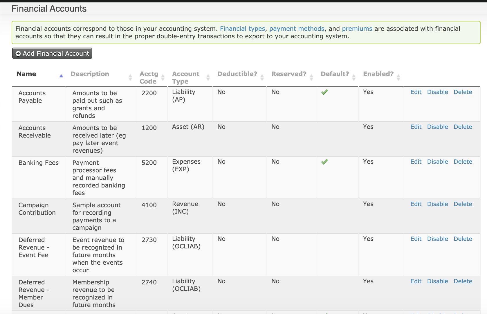

!!! abstract
    This area of CiviCRM code and documentation is a work-in-progress. Not all features will be documented and the core code underlying this area may change from version to version.

This file exists to give an overview of the Financial entities involved in recording Financial data in CiviCRM.

You should only interact with the Financial entities through the relevant apis - generally Order & Payment apis.

The original file for tracking these is [on the old CiviCRM Wik](https://wiki.civicrm.org/confluence/display/CRM/CiviAccounts+Data+Flow).

## Financial Accounts

These are accounting financial accounts. They have fields intended to help map to an accounting package that
are not used functionally in CiviCRM but are available in various reports.

* accounting_code (free-form text)
* account_type_code (free-form text)
* financial_account_type_id (linked to the option group with the name financial_account_type)
* contact id (not used in core but can be used in extensions - e.g. this is used in the [connectors](https://github.com/eileenmcnaughton/nz.co.fuzion.connectors) extension to link some accounts to one Xero account & others to a different one).
* is_header_account

In addition there are some functional fields that affect how sales taxes are calculated:

* tax_rate
* is_tax

Use this field to indiciate whether a financial type is tax deductible for Income Tax purposes:
* is_deductible 
!!! note
CiviCRM itself does not calculate Charitable Tax Receipts - but extensions like [CDN Tax Receipts](https://civicrm.org/extensions/cdn-tax-receipts) do.

## Financial Transactions

Movements into or out of financial accounts are represented by financial transactions in the civicrm_financial_trxn table.

Each financial transaction has a `from_account_id` and a `to_account_id`. These represent movements between financial accounts.

They also have various informative fields:

* trxn_date
* fee_amount, net_amount, total_amount
* currency
* is_payment (is this a payment financial transaction - see section on [payments](#payments))
* payment_instrument_id (links to payment_instrument option group - e.g check, credit card)
* payment_processor_id (when a payment processor has processed the payment)
* card_type_id, pan_truncation, check_number - these are additional bits of information gathered about the payment
* trxn_id, trxn_result_code, order_reference - these are all generated by the payment processor (when there is one) and
stored in CiviCRM when available. The trxn_id is the processor reference for the gateway. Some processors have references
at the order level. Even though these are at the order level there could be more than one per order as more than one.
payment with more than one processor might be paid against an order (contribution), hence they are stored on the financial transaction
* status_id - the intent is that failed as well as successful payments should be stored (and appropriately filtered in bookkeeping reports)

## Payments

Some financial transactions are payments and these are marked with the `is_payment` field on that table. Payments in CiviCRM are a subset
of the rows in `civicrm_financial_trxn`. You should use the Payment API to interact with these payment financial transactions.

Importantly payments will end up moving money ***to*** an account where payments are collected - ie a Bank account
or a Payment Processor account (which in the real world may be an actual account or just a clearing house for nightly payments.)
Negative payments (or refunds) will have the bank or processor account on the ***from*** side of the transaction.

## Financial Items

Financial items exist to track how much has been paid against the various line items within an order / contribution.
In an accounting system this might be called credit-matching.

Each line item will have one financial item denoting payments made against the line item, or a transaction transferring the money to
accounts receivable.
On creation of the order there will be a financial item for each line item and an additional item for every fee amount.

!!! The created financial item should have a status of 'Unpaid' but it seems that this may not always be the case and it may be
    partially paid instead - further auditing is needed as this seems to be linked to use of an old method to create partial payments.
    Financial item statuses are potentially used for reporting but are not used in any functional calculations.

!!! note
    For historical reasons this may not always be true but [it's the goal](https://github.com/civicrm/civicrm-dev-docs/issues/712). Financial items
    may not always be present in practice for pending contributions.

**Financial items changes due to payments**

When a payment is made it might either pay off all the line items, some of each of the line items, specific line items, in part or in full.
Where a line item is now fully paid the status of the related financial item is updated to Paid. An `EntityFinancialTrxn` record is created
in the `civicrm_entity_financial_trxn` table linking the payment to any line items it pays towards, specifying the amount paid on that payment.

If the line item is paid in part then the financial item status should be 'Partly Paid' and the `EntityFinancialTrxn` record specifies the portion
of the line item that has been paid by that payment.

For example if we have the scenario that an Order (Contribution) with 2 line items (values $100 & $200) is created then we will get

* the order
* 1 financial trxn record transferring the cost ($300) to accounts payable
* 2 financial items (one for each line item for the full amount - ie amounts of $100 & $200)
* 2 financial entity transaction records linking the financial items to the accounts receivable transaction - the amounts will be $100 & $200

If we later get a payment for $100 we will see the following changes

* 1 financial trxn record with is_payment and amount of $100. From account is accounts receivable, to account is the payment asset account (e.g Bank account)
* 2 financial entity transaction records linking the financial items payment to the payment transaction (the payment is allocated proportionally
so the amounts are $33.33 and $66.67).

If that payment were to be cancelled (using the Payment.cancel api) we would see the following

* 1 financial trxn record with is_payment = 1 and a negative amount equal to the original payment ($100 in this example). From account is the payment asset account, to account is accounts receivable.
* 2 financial entity transaction records linking the financial items back to the payment reversal transaction. These are effectively reversing
the financial entity transaction records linked to the original payment and the amounts are negative - ie -$33.33 and -$66.67)

!! this same *should* happen for a negative payment although the allocation may be different. There may be a current bug here.

**Financial items changes due to line item changes**

If the line items change then the items financial items have to be updated. Generally the rule is to alter the zero out the
old line item, reverse the financial items and then create a new line item with new financial items. However, this is not
always  possible as there are some scenarios where the schema does not permit this. The has led to
adjustment line items being created in these cases. The issue is that the `civicrm_line_item` table has a unique index for
`entity_table + entity_id + contribution_id + price_field_value_id + price_field_id`.

This means that if a line item with no `price_field_values` (i.e: a text / enter quantity line item) is altered it is not possible
to create a reversal line and a new line within the schema. The same problem occurs when changing a line item with `price_field_values`
***back*** to a `price_field_value` it previously held. In both these scenarios the work around is to have more than one *valid* `financial_item`
against the resulting line item with an *adjustment* entry -  i.e: an additional `financial_item`.
