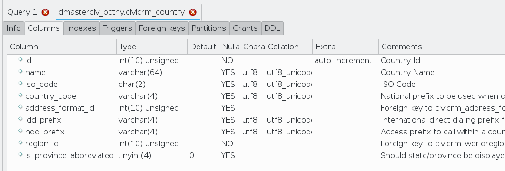
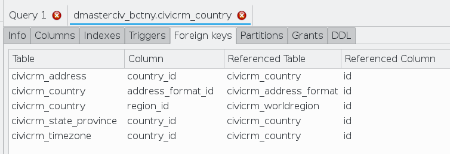

# CiviCRM Schema Design

## Why a Entity Relationship Diagram may *not* be helpful

As some coders are visual learners, ER Diagrams maybe a waste of time for those coders to understand the CiviCRM Database model and structure. Fundamentally CiviCRM's Schema design is way too complex, with at least 150 tables and loads of Foreign Key Constraints linking tables together any such graphic or design document that tries to map out the CiviCRM database design would most likely bring more confusion than help, especially for visual learners.

## Alternate Methods to ERDs to explore CiviCRM's Database Design

Another method of viewing CiviCRM's Database model is to use one of various MySQL coding tools e.g. PHPMyAdmin or [MySQL Workbench](https://www.mysql.com/products/workbench/). These tools allow coders to inspect the Table Structure more easily and look at all the constraints attached to tables very easily.

## MySQL Workbench Workflow

1. Look at the list of tables in the database. The table name generally gives you a good idea of the type of data it stores.
2. Pick one table and look closer. Let's look at `civicrm_country` (a relatively simple example) by opening the "Table inspector" for that table.
    - We can look at the list of columns in the table.
    
    We can see that columns have comments which explain (to some extent) the meaning of the data stored in the columns. From the Column Names and the comments we can start to get some idea of the relationship between tables. For example we can see that there is a column `address_format_id` which indicates to us that the table `civicrm_country` has a relationship to the table `civicrm_address_format`
    - We can also look at the Foreign Keys that are relevant to this table
  
  Here we can get more of a comprehensive picture of what tables `civicrm_country` relates to. We can tell that because we see not only what tables are referenced by `civicrm_country` but also the tables that reference `civicrm_country`. 

## General Characteristics of CiviCRM Tables

When we look at CiviCRM Tables there are a few patterns that generally hold true:

- Every table has a id column which is Auto Increment and therefore unique key for that table
- Columns which reference other tables generally speaking will be named in the format of `other table name` + `_id`. For example in `civicrm_country` there is `address_format_id` which indicates that is references `civicrm_address_format.id`
- Many-to-many relationships use "join tables" as intermediary tables. For example, a contact can have many activity records, and an activity can have many contact records. So the table `civicrm_activity_contact` is used as the glue because it has foreign keys to both.
- In some places CiviCRM defines schema using a construct called [PseudoConstants](schema-definition.md#table-field-pseudoconstant) which produces some slightly more complex logic
    - Lots of columns reference `civicrm_option_values` when they just need a simple (and user-configurable) list of options. For example, look at `civicrm_contribution` which has a column called `payment_instrument_id`. You'll notice there's no table called `civicrm_payment_instrument`. So in this case the `payment_instrument_id` column actually references the value column in `civicrm_option_values` (but only for records in `civicrm_option_values` with the appropriate `option_group_id`.) Here there is no foreign key, so referential integrity is managed at the application layer, not the database layer.
    - Some tables use "dynamic foreign keys". For example, look at `civicrm_note` which has columns `entity_id` and `entity_table`. This is because a note can be attached to different entities (e.g. contact, contribution, etc). So two columns are used to indicate what the note references. Here again, the application layer is responsible for ensuring referential integrity, so you won't find any foreign keys.
