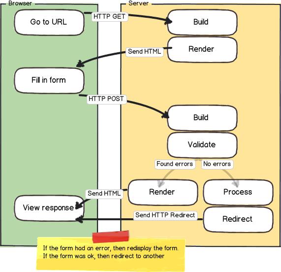

# QuickForm Reference

## Background

Data-entry forms in CiviCRM use an extended variation of [PEAR](http://pear.php.net/)'s `HTML_QuickForm` system. In QuickForm, a web developer defines a new form by creating a "Form" class which implements certain methods (such as "buildForm") and which calls methods to add new form fields (or "elements"). Reference materials for the main QuickForm system can be found online:

- [HTML_QuickForm Documentation Home](http://pear.php.net/package/HTML_QuickForm/docs)
- [HTML_QuickForm Tutorial](http://www.devarticles.com/c/a/Web-Graphic-Design/Using-HTML-Quickform-for-Form-Processing/)
- [HTML_QuickForm Element List](http://pear.php.net/manual/en/package.html.html-quickform.intro-elements.php)
- [(Old Blog) Summary of Page Processing Tools in CiviCRM](http://civicrm.org/node/96)
- [Koumbit QuickForm Cheatsheet](https://wiki.koumbit.net/CiviCrm/QuickForm)

## The Basics

A typical form in CiviCRM looks like this:

```php
class CRM_Example_Form extends CRM_Core_Form {
  /**
   * @var string - Note make variables public to allow form hooks access
   */
  public $_foo;

  /**
   * This function is called prior to building and submitting the form
   */
  public function preProcess() {
    // Perform any setup tasks you may need
    // often involves grabbing args from the url and storing them in class variables
    $this->_foo = CRM_Utils_Request::retrieve('foo', 'String');
  }

  /**
   * Will be called prior to outputting html (and prior to buildForm hook)
   */
  public function buildQuickForm() {
    // Add elements to the form
    $this->add('text', 'my_text_field', ts('Enter Some Text'));
  }

  /**
   * If your form requires special validation, add one or more callbacks here
   */
  public function addRules() {
    $this->addFormRule(array('CRM_Example_Form', 'myRules'));
  }

  /**
   * Here's our custom validation callback
   */
  public static function myRules($values) {
    $errors = array();
    if ($values['foo'] != 'abc') {
      $errors['foo'] = ts('You entered the wrong text!');
    }
    return empty($errors) ? TRUE : $errors;
  }

  /**
   * Called after form is successfully submitted
   */
  public function postProcess() {
    // get the submitted values as an array
    $vals = $this->controller->exportValues($this->_name);
    // Save to the database
    civicrm_api3('foo', 'create', $vals);
  }
}
```

!!! note "builQuickForm v buildForm"
    In CiviCRM Core, sometimes in sub classes e.g. in the Custom Search Sub classes, the function `buildForm` is used instead of `buildQuickForm`, However there will be a call in the parent function for `buildQuickFrom` which then includes the subClasses `buildForm`. This is not standard for new form classes.

## Form Elements

### Basic Types

These basic elements can be added using `CRM_Core_Form()->add()`

| Type | Notes |
| --- | --- | 
| text | Simple text box|
| textarea | Multirow text region. Good for fields like description |
| select | give it css class "crm-select2" to add select2 widget |
| advcheckbox | like "checkbox" element but normalizes data in postProcess |
| radio | Radio options |
| group | mainly useful to contain radios, see addRadio extended method |
| hidden | does not need to be added to the template |
| advmultiselect | takes up a lot of space - consider using select.crm-select2 |
| submit | Buttons generally used to either submit or cancel the form |
| password | Add a password field. The display will be replaced with dots |

### Extended Types

`CRM_Core_Form` includes methods to add special types or sets of form elements not included in basic quickform. See code-level function documentation for details.

| Method | Used For | Notes |
| --- | --- | --- | 
| addButtons | form submit buttons | |
| addRadio | set of radio buttons | | 
| addYesNo | radio buttons with preset 'Yes' & 'No' options | |
| addCheckbox | set of checkboxes | |
| addDateRange | set of "to" and "from" dates | requires an extra template to be included |
| addSelect | autogenerate a select, fetching title and option list from metadata | uses "select2" widget. also adds an "edit options" button visible to admin users  *note: to add a select2 that references an entity, see **addEntityRef** below* |
| addProfileSelector | widget by which users can select, create and edit a profile form | requires extra javascript files added using `CRM_Core_Resources` |
| addSelectOther | select or other option | requires extra javascript in the template |
| addUploadElement | file upload | |
| addCurrency | select currency  | |
| addMoney | money field + select currency | |
| addEntityRef | autocomplete select of contacts, tags, events, etc. | [EntityRef documentation](entityref.md) |

### Deprecated Form Elements

| Method | Was Used For | Notes |
| --- | --- | --- |
| ~~addDate~~ | Datepicker Element | Use `$form()->add('datepicker', ...)` instead. |
| ~~addDateTime~~ | Datepicker with time Element | Use `$form()->add('datepicker', ...)` instead. |
| ~~addWysiwyg~~ | Rich text Area | Removed: Use `$form()->add("wysiwyg", ... )` instead. |
| ~~addCountry~~ | Country Select Field | Removed. Use AddSelect instead or addEntityRef |

## Request Lifecycle




CiviCRM provides a more nuanced request lifecycle than traditional `HTML_QuickForm`. This extended request lifecycle allows the original web developer to create the form using a class – and allows third-party developers to modify the form using hooks. The request lifecycle is divided into a few phases, and each phase may have multiple steps. The phases and steps are presented in sequence:

### Build Phase

Generate a set of HTML form fields (`$form->addElement()`, `$form->add()`, etc) and validation rules (`$form->addFormRule()`) to the form. (Note: The "Build" phase runs during the initial GET request and the subsequent POST request.)

| Step | Audience | Comments |
| --- | --- | --- |
| `CRM_Core_Form::preProcess` (override) | Original Developer | In any subclass of `CRM_Core_Form`, the `preProcess()` function can be overridden. |
| `CRM_Core_Form::buildQuickForm` (override) | Original Developer | In any subclass of `CRM_Core_Form`, the `buildQuickForm()` function can be overridden. | 
| [hook_civicrm_buildForm](../../hooks/hook_civicrm_buildForm.md) | Third-Party Developer |  |
| `CRM_Core_Form::addRules` (override) | Original Developer | In any subclass of `CRM_Core_Form`, the `addRules()` function can be overridden.

### Validate Phase

Examine submitted form data to determine validity. (Note: The "Validation" phase runs during the POST request.)

| Step | Audience | Comments |
| --- | --- | --- |
| (Process rules) | Original Developer & Third-Party Developer | Iteratively process any rules added during the "build" phase (i.e. call any callbacks registered via `$form()->addFormRule()`). |
| [hook_civicrm_validate](../../hooks/hook_civicrm_validate.md) | Third-Party Developer | (Note: This is similar to `hook_civicrm_validateForm` but older) |
| [hook_civicrm_validateForm](../../hooks/hook_civicrm_validateForm.md) | Third-Party Developer | (Note: This is similar to `hook_civicrm_validate`; added in CiviCRM v4.2) |

### Process Phase

Save the data, execute business logic, etc. (Note: The "Process" phase runs during the POST request – but only if the "Validation" was successful) 

| Step | Audience | Comments |
| --- | --- | --- |
| `CRM_Core_Form::postProcess` (override) | Original Developer | In any subclass of `CRM_Core_Form`, the `postProcess()` function can be overridden. |
| [hook_civicrm_postProcess](../../hooks/hook_civicrm_postProcess.md) | Third-Party Developer | |

### Render Phase

Generate HTML using Smarty. 

!!! note
    The "Render" phase does not provide events or hooks to the PHP controller.
