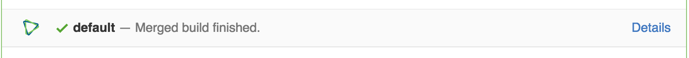
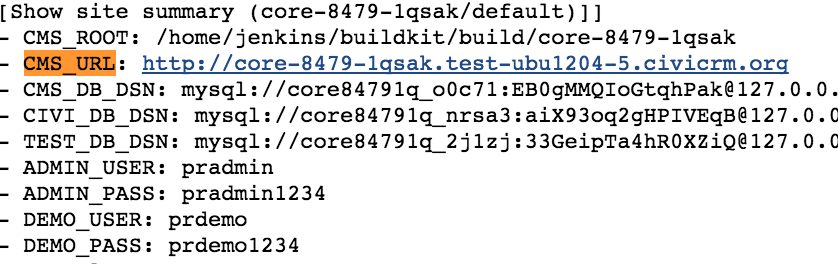

Testing
=======
Testing in CiviCRM is done by a combination of human code review and testing as well as automated testing. Testing is done based on pull requests (PRs) in [Github](https://github.com/civicrm/civicrm-core/pulls). PRs are generally a response to issues reported in [JIRA](https://issues.civicrm.org/), the issue tracking system for CiviCRM. 

Automated tests
---------------

TODO:

 * http://wiki.civicrm.org/confluence/display/CRMDOC/Testing

Manual testing
---------------
When testing this is the proccess you should use:

* Check if the PR is paired with a JIRA issue
* Read the JIRA ticket
* Look at the bug in JIRA and ask yourself if you agree with the analysis of the bug
* Check if the automated tests have passed
* Attempt to replicate the bug
* Comment on the Github PR if you managed to replicate the issue, and how.
* Check that the bug has been fixed with the patch 

In order to reproduce the bug you can reproduce the issue in the appropriate [CiviCRM Sandbox](https://civicrm.org/sandboxes). Enabling debugging can help to get more details.

CiviCRM uses a system called Jenkins to do automated testing. To get to Jenkins results for a specific PR click *Show all checks* and then *Details*. 

When Jenkins runs the tests, it also setups a test site that will be available for aproximately one week. To find the link to the site click "Console Output" on the left hand menu. Click "Full Log" at the top of the page and then you can search for *CMS_URL* in the output. 

 

There are multiple times that CMS_URL is in the log output.  

If a PR is updated or re-tested, the initial test site will be deleted (since a new test site will have been created). 

If the tests have failed for something that we suspect is a random failure, we can ask Jenkins to run the tests again by commenting in the PR "Jenkins, test this please". [see] (https://wiki.jenkins-ci.org/display/JENKINS/GitHub+pull+request+builder+plugin). New contributors to CiviCRM will require an admin to approve running the tests by commenting on the PR "ok to test". Jenkins will automatically respond "can an admin verify this patch?" If the user is trusted, CiviCRM administrators can add the person to the whitelist by commenting "add to whitelist".

Jenkins only builds a Drupal site that is built against the branch that your PR is modifying.  If you need to test a patch against another CMS than you will want to test the patch in your own environment.

If you have an existing environment you can use *git* or *hub* to checkout the specific PR.  

Hub example where 8473 is the PR ID.
`hub checkout https://github.com/civicrm/civicrm-core/pull/8473` 

Git example where 8473 is the PR ID and 4.6 is the branch. 
`git fetch origin pull/8473/head:4.6`

If you do not have an existing environment you can use Buildkit to create one quickly. [Buildkit](https://github.com/civicrm/civicrm-buildkit) is a powerful command line tool for CiviCRM that allows for rapidly creating CiviCRM environments. Buildkit can create installs for Drupal7, Drupal6, WordPress and Backdrop. 

You can for example run `civibuild create dmaster --url http://localhost:8001 --patch https://github.com/civicrm/civicrm-core/pull/8494 --admin-pass s3cr3t` and you will get a test environment with the Drupal, CiviCRM master branch and the patch in PR 8494. You can get much more detailed information in the [Civibuild documentation](https://github.com/civicrm/civicrm-buildkit/blob/master/doc/civibuild.md)

Every month, a release announcement message is sent to participants in the review process. The announcement is sent on the [civicrm-dev mailing-list](http://lists.civicrm.org/lists/info/civicrm-dev) and issue is posted on [github.com/civicrm](http://github.com/civicrm). The GitHub post mentions the account names of everyone who has submitted a PR recently (so that they get a notification).

###Notifications
* When opening a PR, submitter is pointed to the CiviCRM Core [contributing documentation](https://github.com/civicrm/civicrm-core/blob/master/.github/CONTRIBUTING.md)
* At start of month @mentions is used to ping authors, e.g. [https://github.com/civicrm/release-management/issues/2](https://github.com/civicrm/release-management/issues/2)
* The notice to authors contains the Release Planning spreadsheet.  For [example](https://docs.google.com/spreadsheets/d/10EyNqm3-CbAwUjYzckrwSE7VjpZCfatzh-bES59XqA8/edit?usp=sharing). 
* You can also signup for the release week planning emails. For [example](https://gist.github.com/totten/0d05ca4bbe0e1727ee5895f6e588d068)

