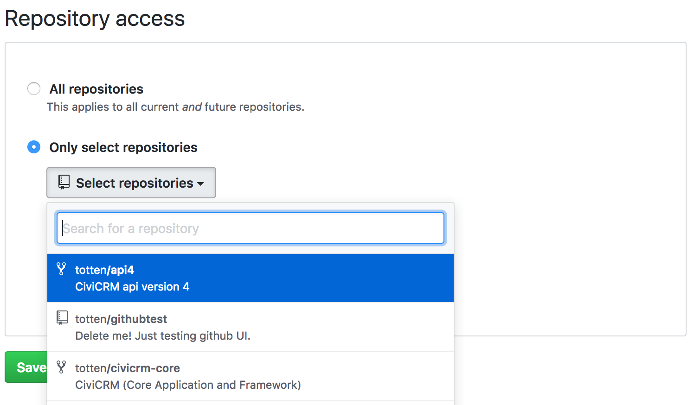

# Continuous Integration

To prevent defects from entering the system or remaining in the system, tests are executed automatically by the Jenkins [continuous integration](https://en.wikipedia.org/wiki/Continuous_integration) server.

Automated tests are executed in a few different circumstances:

* [Proposal testing for core](#pr-core) provides feedback when reviewing specific proposals in [civicrm-core](https://github.com/civicrm/civicrm-core) and other key repositories. This runs as soon as someone submits (or revises) a proposal in Github.
* [Proposal testing for extensions](#pr-ext) provides feedback when reviewing proposals for extensions like [api4](https://github.com/civicrm/api4) and [flexmailer](https://github.com/civicrm/org.civicrm.flexmailer/). This serves a similar purpose, but the mechanics are different.
* [Full matrix testing](#matrix) are the most comprehensive (and resource-intensive) tests. They run every 8-24 hours and feed into decision-making about releases and code-freezes.

The results of the tests are published at [test.civicrm.org](https://test.civicrm.org) and (where feasible) linked into the Github UI.

## Proposal Testing for Core {:#pr-core}

Whenever a *pull-request* (PR) is submitted or revised on Github, Jenkins runs a set of tests. PR test jobs can take anywhere from 5 min to 2 hours to complete.

The CiviCRM system is composed of several `git` repositories and several [test-suites](index.md).  To provide quicker results, tests are selected for relevance -- for example, a patch to `civicrm-core` will trigger almost all tests (because `core` code can be referenced directly or indirectly by any test).  However, a patch to the `civicrm-backdrop` integration will only trigger end-to-end tests (because the Backdrop integration code is relevant in E2E tests) -- it will skip the APIv3 tests (because the APIv3 tests use a mock CMS which is independent of Backdrop).

| Repository         | 
civilint
      | 
PHPUnit
 | 
Karma
 | 
Upgrade
 |
|--------------------|--------------------------------|--------------------------|------------------------|--------------------------|
| `civicrm-core`     | 
✅ 
            | APIv3, Civi, CRM, E2E    | 
✅ 
    | 
✅ 
 |
| `civicrm-packages` |                                | APIv3, Civi, CRM, E2E    | 
✅ 
    | 
✅ 
 |
| `civicrm-drupal`   | 
✅ 
            | E2E, Drupal              | 
✅ 
    | 
✅ 
 |
| `civicrm-backdrop` | 
✅ 
            | E2E                      |                        |                     |
| ***See also***     | 
[civilint](../tools/civilint.md)
 | [PHPUnit Tests](phpunit.md) | 
[Karma Tests](karma.md)
 | 
[Upgrade Tests](upgrades.md)
 |

!!! tip "Quick results for code style"

    Jenkins first runs the fast code-style checks for PHP and Javascript ([civilint](../tools/civilint.md)).  If this finds any problems, it will quickly abort and skip slower tests. When a new contributor is learning the code style, this allows quick iteration.

!!! tip "Executing locally"

    To run all the tests in one of the suites locally, you can use [civi-test-run](../tools/civi-test-run.md).

!!! tip "Alternate CMS testing"

    For PR test jobs against `civicrm-core` and `civicrm-packages`, Jenkins uses [the `drupal-clean` build type](../tools/civibuild.md). If you are fixing an issue with another CMS, you may need to build yourself a local test environment with that CMS.

!!! tip "Whitelist"

    To prevent abuse of the testbot, Jenkins maintains a whitelist of Github contributors. It only runs automated tests if the contributor is recognized.

    For new contributors, Jenkins will automatically post a comment:

    > can an admin verify this patch?

    A Jenkins administrator should skim the PR. They will then comment:

    > jenkins, ok to test

    After a new contributor has submitted a few good PRs, the administrator can add them to the whitelist with another comment:

    > jenkins, add to whitelist

    Thereafter, subsequent PRs will be tested automatically.

!!! tip "Re-running tests"

    If the tests have failed for something that we suspect is a random failure, we can ask Jenkins to run the tests again by commenting in the PR:

    > jenkins, test this please

## Proposal Testing for Extensions {:#pr-ext}

!!! caution "Work in progress"

    This describes a service which is currently in alpha.

The basic ideas are the same -- whenever a *pull-request* (PR) is submitted or revised on Github, Jenkins will be notified. There's a whitelist that determines which repos/PRs/authors will be tested. The test outcome is posted to Github.

However, unlike core testing, the extension testing uses a "convention over configuration" philosophy. Tests can be enabled with a few clicks as long as the extension follows these conventions:

* The extension lives in its own public git repository.
* The root folder includes `info.xml` and `phpunit.xml.dist`.
* If the extension requires any other extensions, these are listed in `info.xml` and published in [the Extension Directory](https://civicrm.org/extensions/).
* The PHPUnit tests are organized into two `@group`s -- `headless` and `e2e`.
* The extension is compatible with the `drupal-clean` build type in [civibuild](../tools/civibuild.md).

The [civix](../extensions/civix.md) code-generator produces compliant code by default.

!!! tip "Availability"

    The test bot supports extensions in the official `civicrm` organization and some paid partner projects. If you'd like to use it on other projects, please consult with the [core team](https://civicrm.org/teams/core-team).

!!! tip "Registration for Github repositories"

    To enable testing on a Github repository, visit [https://github.com/apps/civibot](https://github.com/apps/civibot) and proceed to "Configure". You can install `civibot` for any user/organization -- and then authorize it to access some repositories:

    

    You *may* enable for "All repositories" (current *and* future), even if you have unrelated repositories. Civibot autodetects extensions and ignores other projects.

!!! tip "Registration for Gitlab repositories"

    At time of writing, we have not yet setup a registration process for Gitlab repositories. However, it has an actively considered requirement.

!!! tip "Whitelist"

    To prevent abuse of the testbot, `civibot` checks if you are an owner/collaborator/member of the Github repository:

    * If you have access, it will autotest your pull-requests.
    * If you have access, it will respect manual commands like `/test`.
    * If you do not have access, then you must wait for someone else to issue the `/test` command.

!!! tip "Re-running tests"

    When reviewing a PR, you may request a new test-run with the command `/test`. The command may be interleaved with other discussion as long as it fits on its own line. For example:

    > We should re-test this PR because it's been sitting around for a month.
    >
    > /test

## Full Matrix Testing {:#matrix}

The other type of Job that jenkins runs is what is described as a "matrix" job. This is a much more extended version of the PR job and is usually run against multiple different webserver configurations.

The main difference between the `CiviCRM-Core-Matrix` job and a PR test job is that it runs more upgrade tests than the `CiviCRM-Core-PR`.

The other matrix job is one that runs the webtests.

The matrix jobs operate on two main combinations, a PHP5.5 + MySQL5.5 server and a PHP7.0 + MySQL5.7 test seerver.

Due to the size of the test matrix, jobs can take from 2 to 24 hours to complete depending on the job.

!!! tip "Build Schedule"

    Jenkins periodically runs the full suite (once every 4-24hr) on the official codebase.

Code-style is not checked on this build, but all upgrade and web tests are run.

