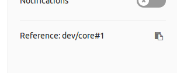

# Issue-tracking systems

As of 2019, CiviCRM uses two different systems for tracking and managing issues (aka tickets) - GitLab and GitHub. Until early 2018, Jira was also used. This page offers a brief summary of the systems and helps developers understand when and how to use them.

## Systems

### GitLab {:#gitlab}

**[lab.civicrm.org](http://lab.civicrm.org)**

Used as an issue-tracking system for:

* **[CiviCRM](https://lab.civicrm.org/groups/dev/-/issues)** (including `civicrm-core`, `civicrm-packages`, `civicrm-drupal`, `civicrm-joomla`, and `civicrm-wordpress`)
* [civicrm.org website issues](https://lab.civicrm.org/marketing-team/civicrm-website)
* [infrastructure issues](https://lab.civicrm.org/infrastructure/ops/issues)
* *...and many [other projects](https://lab.civicrm.org/explore/projects)*

#### How GitLab organizes things {:#gitlab-organizing}

* At the top level, GitLab is divided into [_groups_](https://lab.civicrm.org/dashboard/groups) (which are mostly analogous to _GitHub's_ concept of "organizations"). 
* Groups own *projects* (and individual users can own projects, too).
* Projects often contain *issues*.

Issues about CiviCRM itself are opened within the [Development Team's projects](https://lab.civicrm.org/dev/).

#### Referencing GitLab issues {:#gitlab-reference}

Use text like `dev/core#1` to reference specific issues in your [commit messages](git.md#commit-messages), [pull request subjects](git.md#pr-subject), and other communication.

In the above example:

* `dev` is the *group*
* `core` is the *project*
* `1` is the *issue number*

!!! tip
    GitLab displays the issue reference at the bottom of the right-hand column along with a link that copies the reference to your clipboard:
    
    

### GitHub {:#github}

**[github.com/civicrm](https://github.com/civicrm)**

Besides being a code repository for most CiviCRM projects, GitHub is used as an issue-tracking system for:

* [buildkit](https://github.com/civicrm/civicrm-buildkit/issues)
* [cv](https://github.com/civicrm/cv/issues)
* [civix](https://github.com/totten/civix)
* *...and many [other projects](https://github.com/civicrm)*

!!! note
    Some projects (e.g. CiviCRM core) have their repository hosted on GitHub but do *not* use the GitHub issue-tracking functionality. For these projects you will notice there is no "Issues" tab.

### Jira (deprecated) {:#jira}

**[issues.civicrm.org](https://issues.civicrm.org/jira)**

Used as an issue-tracking system until early 2018 for:

* **[CiviCRM (`CRM`)](https://issues.civicrm.org/jira/browse/CRM)**  (including `civicrm-core`, `civicrm-packages`, `civicrm-drupal`, `civicrm-joomla`, and `civicrm-wordpress`)
* [CiviVolunteer (`VOL`)](https://issues.civicrm.org/jira/browse/VOL)
* [Extension Review Queue (`EXT`)](https://issues.civicrm.org/jira/browse/EXT)

## Guidelines for creating issues {:#guidelines}

### When to create an issue {:#when-to-create}

If you are ready to make a change to CiviCRM, you can [submit a pull request](git.md#pr) *without* creating an issue first.

Otherwise, you'll want to create an issue in order to track work that might need to be done at some point in the future.

### Check the latest version {:#check-version}

There's no sense in planning any changes to CiviCRM's core code without looking at the most recent release.  Any changes you make will be based upon it, and it may include a fix or attempted resolution that may change your thinking about the issue.

It's best to start with upgrading your own site rather than just trying to use one with demo data.  That way, you can be sure to know how the system behaves with your real-life data.  

If upgrading your site doesn't resolve it, try a plain installation of CiviCRM, such as one generated with Buildkit.  This will ensure that your site-specific data isn't the problem, and having a plain vanilla site will be important for trying out your changes later.

### Talk over the issue {:#talk}

To get your ideas together for later steps, it's best to start with a conversation.  This doesn't need to be technical, but it should be with someone familiar with using CiviCRM.  A coworker or consultant might be a place to start, or you could talk it over on [Mattermost](https://chat.civicrm.org/) or [Stack Exchange](http://civicrm.stackexchange.com/).

In your conversation, think about some of the following questions:

-   How severe is the impact on organizations using CiviCRM?

-   Has this feature's behavior changed recently?  Is a bug a regression, or has it always been this way?  Is this a new feature that doesn't handle all situations properly?

-   What skills, time and/or money are you able to contribute to this issue?  Will you need the skills and/or money of others as well?

-   Who might like things the way they are?  Are there ways to resolve the issue that meet their needs as well as yours?

-   Will your change be self-explanatory, or will other users need an explanation?

If you are able to coherently explain the problem and resolution&mdash;and reasonably confident that fix will be good for everyone&mdash;it's time to register the issue with CiviCRM.

### Research existing issues {:#research}

Search for existing issues that may be the same as or related to yours. Because CiviCRM transitioned from [Jira](#jira) to [GitLab](#gitlab) in early 2018, you'll need to search in both systems for existing issues. Jira's search will order by relevance, but you are searching over a decade of issues, so you may get overwhelmed with old items.  Consider filtering Created Date to two years ago or newer.

If an issue directly describes your situation, your job will be different: read it over, and edit or comment as necessary.  If the issue is marked as closed and completed, you should create a new issue indicating a regression, and you should link to the original issue you found.

If issues you find are related but not quite the same, you should still record them so that you can mention them in the issue you create.

### Open a blank issue {:#new}

Begin creating your issue as follows:

1. Sign in to [GitLab](https://lab.civicrm.org/)
1. Navigate to the appropriate GitLab project. For CiviCRM core, look in the [Development Team's projects](https://lab.civicrm.org/dev/).
1. Click the `+` button at the top of the screen and choose **New Issue**.

### Describe the issue {:#describe}

Give it a title that describes your issue concisely, and explain the issue in the details.  In writing your issue, remember that your audience includes a variety of people:

-   Other users encountering the same problem now
-   Maintainers deciding whether to include your code
-   Developers considering future changes
-   The release notes editor compiling the notes
-   Users browsing what's new in an upcoming version

Readers will come from different perspectives and contexts, so thorough explanations and coherent summaries are valuable.  A well-written issue will be taken more seriously, increasing the likelihood that your changes are accepted and that others engage in your issue.

#### Naming your issue {:#naming}

*Vague issue titles are boring and unhelpful.*  They don't inspire people to use or upgrade CiviCRM, and they make it difficult for implementors and developers to know what's different.  Don't say "improve" unless the improvement is so scattered and subtle that you can't say anything else.  Instead, make the specific improvements explicit.

Bug titles are slightly different, but they still should never be vague.  *A good bug title simply says the bad thing that's happening.*   Great examples include the following:

- "Batch merge redirects users to snippet URL"
- "Contribution page: missing translation"
- "Cannot create smart group from 'Find participants'"  

The best leave no question as to what was going wrong or what has changed: something undesirable was happening, and once this issue is resolved, it won't happen anymore.

#### Issue scope {:#scope}

*It's important to keep your issue snappy and closeable.*  A issue that stays open long after commits have been merged into core is confusing to users and demoralizing for contributors.  The way to prevent this is to make issues distinct and coherent so they're clearly done or not done.

Better yet, describe the issue distinctly and coherently yourself.  If you find an existing issue that was reported vaguely, there's no reason not to revise the description.  If the original issue involves several things, don't be shy about closing it and opening new ones--just document what you've done.

A rule of thumb is that if an issue has more than 2 or 3 pull requests in GitHub (described below), something is wrong.  It may be a series of false starts, and that's okay, but if it's a bunch of pull requests against the same repository, you probably should have opened new issues to describe the separate features or bugs&mdash;or to document a regression or feature gap.

See also: [pull request scope](git.md#pr-scope)

#### Categorization {:#categorization}

Categorization is useful for finding issues, and it also determines how issues appear in the release notes.

Use the Labels field to apply any relevant labels to your issue.

#### Confidentiality {:#confidentiality}

Issues can be marked Confidential, this is a useful "middle ground" status for issues which perhaps shouldn't be public but which are **not** security issues. If you have a security issue please report it as described at [Reporting a Security Vulnerability](../security/reporting/).

In GitLab a user can be either anonymous (no account), have a GitLab account but not be a project member, or be a project member. The confidential checkbox on issues will hide it from anonymous users and non-project members.

Anyone with an account can create confidential issues, but non-project members will only see their own. Please use confidential issues only where appropriate - transparency is important in our development processes and most development/code-related issues should be public.

## Guidelines for triaging issues {:#triage}

*This is the outcome of a meeting on 'how we do triage now we are in gitlab'*

### Identifying bugs - aka triage

Triage is how we deal with incoming bug reports &

    * Categorise them

    * Escalate any new critical bugs or regressions

    * Provide first level support and / or ask additional questions / add additional information

Triage needs to be a fairly quick task in most instances & then depending on the extent to which the original submitter engages some tasks might not get much more attention.

Triage is done from this screen https://lab.civicrm.org/groups/dev/-/boards and in general the goal of 'product-maintenance' is to keep the first three columns clear - ie. triage, regressions & critical bugs.

### Categorisation

In Gitlab, issues are categorized by "Label", and multiple labels may be applied.  A few of the most important labels are standalone terms:

* __`regression`__ - A problem which was demonstrably introduced by a recent change (*last few months*).
* __`triaged`__ - The issue has received an initial evaluation/categorization.
* __`prioritised`__ - The issue was designated by the product maintenance team as a priority.

Additionally, there are [a number of specific labels](https://lab.civicrm.org/dev/core/-/labels) organized with prefixes. This list is easier to navigate if you know the prefixes:

* __`comp:{$X}`__ - The *component* or *subsystem* or [functional area](https://stackoverflow.com/questions/16475979/what-is-the-difference-between-functional-and-non-functional-requirement).
    * __Example__: The CiviMail component addresses the functional requirements to compose, send, and track email-blasts.  Any bug, feature, or improvement relating to email-blasts would be `comp:CiviMail`.
* __`sig:{$X}`__: The *signficance* or *quality* or [non-functional requirement](https://stackoverflow.com/questions/16475979/what-is-the-difference-between-functional-and-non-functional-requirement).
    * __Example__: If a screen unexpectedly terminates after pressing the letter "p", then it is not functioning correctly. That screen has a bug (`sig:bug`).
    * __Example__: If a screen runs too slowly or consumes too many resources (CPU/RAM/disk), then the functionality is correct, but the screen has a `sig:performance` issue.
* __`needs:{$X}`__ - The next step that needs work/action.
    * __Example__: Suppose an issue has been investigated and a patch was approved for the next release. The patch adds a new field, and this field needs to be explained in the "CiviCRM User Guide". The issue `needs:documentation`.
* __`type:{$X}`__ - The *type* indicates how this issue is being shepherded.
    * __Example__: Suppose someone filed an issue because they believed it was important - but they did not have any specific capacity or resources allocated to fixing it. They're looking for other people to help with understanding/resolving it. This is a `type:request`.

For the most complete, current list of labels, see [Gitlab: Development > Core > Labels](https://lab.civicrm.org/dev/core/-/labels).

### Escalate any new critical bugs or regressions

Part of the triage process is figuring out if a bug is critical or a regression. Where they are they will be tagged and relevant people will be pinged on chat and from the issue.

### Provide first level support and / or ask additional questions / add additional information

The triager should ask questions if the issue is unclear or it is not clear how to replicate. Optionally the triager can try to replicate the bug (which has the benefit of testing the rc). The triager does not need to wait for responses before triaging the issue but if there is any possibility the bug is critical or a regression then they should add those tags so the issue does not lose visibility once triaged (they can be removed later after analysis)

